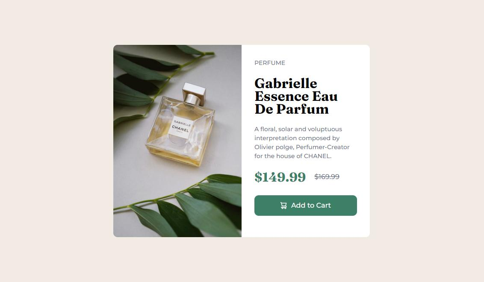

# Frontend Mentor - Product preview card component solution

This is a solution to the [Product preview card component challenge on Frontend Mentor](https://www.frontendmentor.io/challenges/product-preview-card-component-GO7UmttRfa). Frontend Mentor challenges helps to improve coding skills by building realistic projects. 

## Table of contents

- [Overview](#overview)
  - [The challenge](#the-challenge)
  - [Screenshot](#screenshot)
  - [Links](#links)
- [My process](#my-process)
  - [Built with](#built-with)
  - [Continued development](#continued-development)
  - [Useful resources](#useful-resources)
- [Author](#author)

## Overview
Product Preview Card is a component builded with HTML, SASS and Bootstrap. I used bootstrap for the responsive part for containers and contents in this component and compiling sass to speed my work my CSS styles.
### The challenge

Users should be able to:

- View the optimal layout depending on their device's screen size
- See hover and focus states for interactive elements

### Screenshot

### Links

- Solution URL: [Add solution URL here](https://your-solution-url.com)
- Live Site URL: [Add live site URL here](https://arr-product-preview-card-component.vercel.app/)

## My process
1. Firts and the most important part i think is to know which is the main container of the component, from there i can start building the inner section of the rest. 
- Main Container, Firts block, Second block.

I always enjoy to much building in HTML this type of designs that looks this nice.
### Built with

- Semantic HTML5 markup
- CSS custom properties
- Flexbox
- Mobile-first workflow
- [SCSS](https://sass-lang.com/) - SCSS custom properties
- [Bootstrap](https://getbootstrap.com/) - Bootstrap 5

- [Styled Components](https://styled-components.com/) - For styles

### Continued development

I keep in mind this kind of component for React. I think the best way to build components is React. Im very excited in made more animations for my projects is something that have to implement more often.

Right now i'm focused in doing all type of projects to have something more than work projects in private repos to show.

### Useful resources

- [Boilerplate HTML5](https://html5boilerplate.com/) - This proyect was made using BoilerPlate HTML Framework to get better performance and compatibility for the users.

## Author

- Website - [Lucas E.](https://arr-dev.vercel.app)
- Frontend Mentor - [@arrejoria](https://www.frontendmentor.io/profile/arrejoria)
